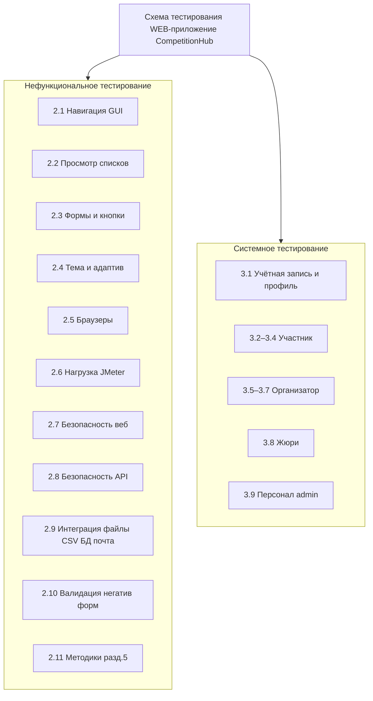

# Инструкция: схема тестирования CompetitionHub (формат как в примере K2WEB)

Основа: **«Документ 3»** (приложение Б) — п. **3.1**, перечень **3.2**, **таблица 3** (тест-план), **раздел 5** (методы).

**Формат примера:** одна верхняя подпись **«Схема тестирования WEB-приложение …»**, от корня **две крупные ветви**:

1. **Нефункциональное тестирование** (слева) — группы проверок «сквозь систему» без привязки к сценарию одной роли.  
2. **Системное тестирование** (справа) — сверху **общий блок** входа и учётной записи, ниже **вертикальные колонки по ролям** из п. 3.1; в каждой колонке — **листья** (конкретные проверки), как в примере с клиентом / механиком / аналитиком.

Ниже — **развёрнутое дерево текстом**: много **промежуточных блоков** (категорий) и **листьев** — в формулировках **«Тестирование просмотра / нажатия / отправки / …»** по действиям пользователя и типам проверок из **документа 3** (п. 3.2, тест-план). Чтобы схема **не была мелкой**, используйте **два листа А4 альбом** (**лист А** — только **разделы 2.1–2.11**; **лист Б** — **раздел 3**: общий блок учётки и четыре колонки ролей; корень можно продублировать на листе Б или связать стрелкой с листа А) **или** масштаб **60–70 процентов** при печати на одном листе.

---

## 1. Корень схемы

В центре или сверху по центру листа (альбомная ориентация А4 удобнее):

**Схема тестирования WEB-приложение CompetitionHub**

От этого блока **две линии вниз или в стороны**:

- влево — к заголовку **«Нефункциональное тестирование»**;
- вправо — к заголовку **«Системное тестирование»**.

---

## 2. Ветвь «Нефункциональное тестирование» (левая часть, много блоков)

Каждый подпункт **2.x** на схеме — **отдельный прямоугольник-заголовок**; каждый маркер «Тестирование …» — **отдельный лист** (маленький прямоугольник) либо строка внутри многострочного блока. Так схема **заполняет лист** и читается как перечень работ.

### 2.1. Навигация и каркас страниц (GUI)

- Тестирование отображения сайдбара на главной без входа  
- Тестирование нажатия «Главная» и возврата на центр событий  
- Тестирование нажатия «Соревнования» и открытия списка  
- Тестирование нажатия «Хакатоны» и открытия списка  
- Тестирование отображения блока «Аккаунт» для гостя  
- Тестирование отображения блока «Кабинет» после входа  
- Тестирование нажатия «Профиль» в кабинете  
- Тестирование нажатия «Уведомления» и счётчика непрочитанных  
- Тестирование нажатия «Панель управления» для staff  
- Тестирование нажатия «Выйти» и исчезновения кабинета  
- Тестирование нажатия «Меню» на узком экране и раскрытия сайдбара  
- Тестирование просмотра футера и базовых ссылок (итоги, архив на главной)  
- Тестирование перехода по ссылке на публичные итоги с главной  
- Тестирование перехода по ссылке на архив с главной  
- Тестирование отсутствия «битых» ссылок в сайдбаре на основных ролях  

### 2.2. Отображение списков и карточек (просмотр данных)

- Тестирование просмотра карточек соревнований в сетке/списке  
- Тестирование отображения статуса этапа на карточке турнира  
- Тестирование отображения дат на карточке при заполненных полях  
- Тестирование просмотра пустого списка соревнований при фильтре «нет совпадений»  
- Тестирование просмотра карточек хакатонов  
- Тестирование просмотра страницы карточки соревнования (заголовок, описание, блоки)  
- Тестирование просмотра списка задач турнира  
- Тестирование просмотра строк таблицы результатов (место, участник, баллы)  
- Тестирование просмотра списка участников турнира  
- Тестирование просмотра списка объявлений на карточке турнира  
- Тестирование просмотра страницы публичных итогов без авторизации  
- Тестирование просмотра страницы архива без авторизации  
- Тестирование просмотра страницы сертификата при допустимых условиях  

### 2.3. Формы ввода и кнопки действий (UI)

- Тестирование отображения полей формы регистрации  
- Тестирование отображения полей формы входа  
- Тестирование отображения формы создания соревнования  
- Тестирование отображения формы редактирования соревнования  
- Тестирование отображения формы создания задачи  
- Тестирование отображения формы редактирования задачи  
- Тестирование отображения формы отправки решения (текст / варианты / соответствие / файл)  
- Тестирование отображения формы оценки решения  
- Тестирование отображения формы объявления  
- Тестирование отображения формы профиля  
- Тестирование отображения кнопок «Сохранить», «Отправить», «Удалить», «Оценить»  
- Тестирование отображения диалога подтверждения удаления соревнования  
- Тестирование отображения диалога подтверждения удаления задачи  
- Тестирование отображения панели «Поиск и фильтр» в списке соревнований  
- Тестирование отображения фильтров в списке хакатонов  

### 2.4. Тема оформления и адаптив

- Тестирование переключения на тёмную тему и перерисовки страницы  
- Тестирование переключения на светлую тему и перерисовки страницы  
- Тестирование сохранения темы после повторного входа  
- Тестирование просмотра главной в тёмной теме  
- Тестирование просмотра таблицы результатов в тёмной теме  
- Тестирование просмотра формы задачи на ширине 1366 px  
- Тестирование просмотра формы задачи на Full HD  
- Тестирование горизонтальной прокрутки широких таблиц на узкой ширине  
- Тестирование отображения шапки при прокрутке длинной страницы  

### 2.5. Совместимость (браузеры и разрешение)

- Тестирование открытия главной в Google Chrome  
- Тестирование открытия главной в Microsoft Edge  
- Тестирование открытия главной в Mozilla Firefox  
- Тестирование отправки решения в Chrome  
- Тестирование выгрузки CSV в Edge  
- Тестирование чата хакатона в Firefox  
- Тестирование масштаба страницы 100 процентов в браузере  
- Тестирование масштаба 125 процентов (читаемость форм)  

### 2.6. Нагрузочное и стрессовое (по плану работ)

- Тестирование сценария JMeter: повторяющиеся GET главной  
- Тестирование сценария JMeter: GET списка соревнований под нагрузкой  
- Тестирование сценария JMeter: POST вход (ограниченно, не блокировать учётку)  
- Тестирование отклика сервера при 10 параллельных пользователях (ориентир)  
- Тестирование отклика при длительной сессии одного пользователя  

### 2.7. Безопасность и разграничение доступа (веб)

- Тестирование запрета доступа участника к `/competitions/create/`  
- Тестирование запрета доступа участника к `/admin/`  
- Тестирование доступа staff к `/admin/`  
- Тестирование запрета редактирования чужого соревнования участником  
- Тестирование запрета оценки решения участником  
- Тестирование отображения сообщения при отказе в праве  
- Тестирование редиректа при отказе в праве (если применимо)  
- Тестирование прямого URL формы отправки решения без регистрации  
- Тестирование прямого URL оценки без роли жюри/организатора  
- Тестирование отсутствия чужих персональных данных в HTML ответах участника  

### 2.8. Безопасность API и токены

- Тестирование запроса GET `/api/...` без токена (ожидается 401)  
- Тестирование запроса с невалидным JWT  
- Тестирование запроса с просроченным access-токеном (если настроено)  
- Тестирование получения пары токенов по `/api/auth/token/`  
- Тестирование GET соревнований с Bearer для участника  
- Тестирование GET соревнований анонимом (набор полей)  
- Тестирование отсутствия «организаторских» полей у ответа API для участника  
- Тестирование отправки решения через API при наличии маршрута и прав  

### 2.9. Интеграция: файлы, CSV, БД, почта

- Тестирование загрузки файла материала к задаче организатором  
- Тестирование загрузки файла в решении участником (при допустимом типе)  
- Тестирование сообщения об ошибке при недопустимом типе/размере файла  
- Тестирование скачивания CSV результатов и открытия в Excel/LibreOffice  
- Тестирование скачивания CSV участников  
- Тестирование скачивания CSV решений  
- Тестирование корректности кодировки и разделителей CSV  
- Тестирование сохранения записи в PostgreSQL после создания турнира  
- Тестирование каскадного поведения при удалении турнира (по факту схемы)  
- Тестирование отправки письма сброса пароля (если включено)  
- Тестирование отображения ошибки при сбое SMTP  

### 2.10. Серверная валидация и сообщения (негатив форм)

- Тестирование отправки регистрации с пустым логином  
- Тестирование отправки регистрации с неверным форматом e-mail  
- Тестирование регистрации с уже существующим e-mail  
- Тестирование создания задачи с пустым названием  
- Тестирование создания соревнования с несогласованными датами (если валидируется)  
- Тестирование отправки решения без выбора варианта (тип «выбор»)  
- Тестирование отображения ошибок под полями формы  
- Тестирование сохранения частично заполненной формы профиля с ошибкой  

### 2.11. Методы испытаний (связь с разделом 5 документа 3)

Отдельный блок-«сноска» (по желанию): **Тестирование по тест-кейсам (чёрный ящик)**; **динамическое**; **системное**; **функциональное**; **ручное**; **позитивное**; **негативное**; при необходимости — **автоматизированное** (unit/API); **нагрузочное**; **интеграционное**; **безопасность**.

---

## 3. Ветвь «Системное тестирование» (правая часть, по действиям)

Сверху — широкий блок **«Учётная запись, сеанс, профиль»**. Ниже — **четыре колонки** с заголовками ролей. В каждой колонке каждый маркер — **отдельный лист** на схеме (как в примере K2WEB: много мелких прямоугольников).

### 3.1. Общий блок — учётная запись, сеанс, профиль, валидация

- Тестирование нажатия «Регистрация» в блоке «Аккаунт»  
- Тестирование просмотра страницы регистрации  
- Тестирование ввода логина, e-mail, пароля, подтверждения пароля  
- Тестирование нажатия «Зарегистрироваться» при корректных данных  
- Тестирование просмотра автоматического входа после регистрации  
- Тестирование нажатия «Войти»  
- Тестирование просмотра формы входа  
- Тестирование ввода логина и пароля и нажатия «Войти»  
- Тестирование просмотра главной после успешного входа  
- Тестирование нажатия «Выйти»  
- Тестирование просмотра появления блока «Аккаунт» после выхода  
- Тестирование нажатия «Профиль»  
- Тестирование просмотра данных профиля  
- Тестирование нажатия «Редактировать профиль»  
- Тестирование изменения ФИО и организации и нажатия «Сохранить»  
- Тестирование просмотра обновлённого профиля  
- Тестирование смены темы в профиле или переключателе  
- Тестирование нажатия «Сменить пароль» (если выведено)  
- Тестирование запроса сброса пароля по e-mail (если выведено)  
- Тестирование перехода по ссылке из письма сброса (если настроено)  
- Тестирование публичной карточки профиля по ссылке (если есть в проекте)  

### 3.2. Колонка «Участник» — главная, соревнования, задачи, решения

- Тестирование просмотра главной без входа (сводка, ссылки)  
- Тестирование просмотра главной после входа (активные участия, быстрые действия)  
- Тестирование нажатия «Соревнования»  
- Тестирование просмотра поля поиска по названию  
- Тестирование ввода подстроки в поиск и применения поиска  
- Тестирование просмотра фильтра по статусу «Регистрация»  
- Тестирование просмотра фильтра по статусу «Идёт»  
- Тестирование просмотра фильтра по статусу «Завершено»  
- Тестирование применения фильтра по аудитории  
- Тестирование применения фильтра по уровню  
- Тестирование применения фильтра по возрасту  
- Тестирование применения признака «только со свободными местами»  
- Тестирование нажатия по карточке соревнования  
- Тестирование просмотра описания и статуса на карточке турнира  
- Тестирование просмотра дат начала и окончания на карточке  
- Тестирование нажатия «Зарегистрироваться» на этапе регистрации  
- Тестирование просмотра сообщения об успешной регистрации  
- Тестирование просмотра кнопки «Отменить регистрацию»  
- Тестирование нажатия «Отменить регистрацию» на допустимом этапе  
- Тестирование перехода по ссылке «Задачи» с карточки турнира  
- Тестирование просмотра списка задач  
- Тестирование применения фильтра по предмету в списке задач  
- Тестирование применения фильтра по типу задачи  
- Тестирование нажатия по названию задачи  
- Тестирование просмотра условий видимости текста задачи по расписанию  
- Тестирование просмотра кнопки «Отправить решение» в допустимом окне  
- Тестирование нажатия «Отправить решение»  
- Тестирование просмотра формы решения для типа «краткий ответ»  
- Тестирование ввода текста ответа и нажатия «Отправить»  
- Тестирование просмотра формы с вариантами ответа и выбора варианта  
- Тестирование просмотра формы типа «соответствие» и отправки пары  
- Тестирование прикрепления файла к решению при разрешении типа  
- Тестирование просмотра сообщения «Решение отправлено»  
- Тестирование нажатия «Мои решения» на карточке задачи  
- Тестирование просмотра списка своих отправок по задаче  
- Тестирование попытки отправки решения без регистрации (негатив)  
- Тестирование попытки отправки на этапе «Регистрация» (негатив)  
- Тестирование попытки отправки вне окна расписания задачи (негатив)  
- Тестирование просмотра ссылки на материал организатора (скачивание/открытие)  
- Тестирование нажатия «Соревнования» после сценария турнира  

### 3.3. Колонка «Участник» — публичные страницы, сертификат, уведомления

- Тестирование открытия `results/` в адресной строке без входа  
- Тестирование просмотра списка завершённых турниров на странице итогов  
- Тестирование открытия `archive/` без входа  
- Тестирование просмотра блоков архива соревнований и хакатонов  
- Тестирование перехода по ссылке сертификата для завершённого турнира  
- Тестирование просмотра оформления сертификата  
- Тестирование отказа в сертификате при невыполненных условиях  
- Тестирование нажатия «Уведомления»  
- Тестирование просмотра списка уведомлений  
- Тестирование просмотра текста уведомления после смены этапа турнира  
- Тестирование просмотра текста уведомления после смены этапа хакатона  

### 3.4. Колонка «Участник» — хакатоны, команды, чат

- Тестирование нажатия «Хакатоны» в сайдбаре  
- Тестирование просмотра списка хакатонов  
- Тестирование применения фильтров списка хакатонов  
- Тестирование нажатия по карточке хакатона  
- Тестирование просмотра описания и этапов хакатона  
- Тестирование нажатия регистрации на хакатоне в допустимой фазе  
- Тестирование просмотра статуса участия после регистрации  
- Тестирование перехода в раздел команд (`teams`)  
- Тестирование просмотра списка команд  
- Тестирование нажатия «Создать команду» (капитан)  
- Тестирование заполнения названия команды и сохранения  
- Тестирование подачи заявки в команду участником  
- Тестирование просмотра заявки у капитана  
- Тестирование одобрения заявки капитаном  
- Тестирование отклонения заявки капитаном  
- Тестирование ввода текста в поле чата и отправки сообщения  
- Тестирование просмотра сообщения в ленте общего чата  
- Тестирование переключения канала «организатор — команда» и отправки сообщения  
- Тестирование просмотра раздела участников хакатона (если доступен участнику только просмотр — уточнить по роли)  

### 3.5. Колонка «Организатор» — соревнование и этапы

*Дублируйте на схеме блок «Сценарии участника» стрелкой «наследует» или перечислите те же листья повторно — на рисунке обычно **дублируют** для наглядности ширины колонки.*

- Тестирование нажатия «Создать соревнование» на главной или в списке  
- Тестирование просмотра формы создания соревнования  
- Тестирование заполнения названия, описания, статуса, дат, аудитории, уровня, квоты, возраста  
- Тестирование нажатия «Сохранить» при создании  
- Тестирование просмотра нового турнира в списке  
- Тестирование нажатия «Редактировать» на карточке своего турнира  
- Тестирование изменения названия и нажатия «Сохранить»  
- Тестирование просмотра обновлённого названия на карточке  
- Тестирование нажатия «Удалить» на своём турнире  
- Тестирование нажатия подтверждения в диалоге удаления турнира  
- Тестирование просмотра отсутствия турнира в списке после удаления  
- Тестирование нажатия быстрой смены этапа на карточке турнира  
- Тестирование выбора нового этапа в элементе управления  
- Тестирование просмотра сообщения об успешной смене этапа  
- Тестирование просмотра ссылок «Задачи», «Участники», «Результаты», «Объявления» на карточке  

### 3.6. Колонка «Организатор» — задачи, объявления, участники, результаты

- Тестирование нажатия «Задачи» на карточке турнира  
- Тестирование нажатия «Добавить задачу»  
- Тестирование выбора предмета и типа задачи на форме  
- Тестирование заполнения текста задачи, баллов, порядка  
- Тестирование добавления вариантов ответа для типа «выбор»  
- Тестирование отметки верных вариантов  
- Тестирование добавления пар «соответствие»  
- Тестирование загрузки файла материала организатора  
- Тестирование настройки расписания открытия и закрытия приёма  
- Тестирование нажатия «Сохранить» при создании задачи  
- Тестирование просмотра задачи в списке после создания  
- Тестирование нажатия «Редактировать» у задачи  
- Тестирование изменения описания и сохранения  
- Тестирование нажатия «Удалить» у задачи  
- Тестирование подтверждения удаления задачи в диалоге  
- Тестирование просмотра отсутствия задачи в списке  
- Тестирование нажатия «Добавить объявление»  
- Тестирование ввода текста объявления и сохранения  
- Тестирование просмотра объявления на карточке турнира  
- Тестирование редактирования объявления  
- Тестирование удаления объявления с подтверждением  
- Тестирование перехода к списку участников турнира  
- Тестирование просмотра таблицы участников  
- Тестирование нажатия выгрузки участников в CSV (если есть)  
- Тестирование перехода к «Результаты»  
- Тестирование просмотра таблицы мест и баллов  
- Тестирование нажатия «Скачать CSV» результатов  
- Тестирование нажатия выгрузки решений в CSV (если есть)  

### 3.7. Колонка «Организатор» — оценка, хакатон, команды

- Тестирование перехода «Все решения» по задаче  
- Тестирование просмотра таблицы/списка решений участников  
- Тестирование нажатия «Оценить» у строки решения  
- Тестирование просмотра формы статуса, баллов, комментария  
- Тестирование ввода баллов и нажатия «Сохранить»  
- Тестирование просмотра обновлённых баллов в списке  
- Тестирование просмотра истории изменения оценки (если выведена)  
- Тестирование нажатия «Создать хакатон»  
- Тестирование заполнения полей хакатона и сохранения  
- Тестирование редактирования хакатона  
- Тестирование удаления хакатона с подтверждением  
- Тестирование смены этапа хакатона  
- Тестирование просмотра списка участников хакатона организатором  
- Тестирование назначения участника в команду (если реализовано)  
- Тестирование просмотра чата команды как организатор в канале «организатор — команда»  

### 3.8. Колонка «Жюри»

- Тестирование входа под учётной записью жюри  
- Тестирование открытия списка соревнований доступных жюри  
- Тестирование открытия карточки турнира в пределах прав  
- Тестирование перехода к списку задач турнира  
- Тестирование открытия карточки задачи при открытых ограничениях видимости  
- Тестирование просмотра текста задачи (если разрешено)  
- Тестирование перехода «Все решения»  
- Тестирование просмотра списка решений без лишних персональных полей  
- Тестирование нажатия «Оценить»  
- Тестирование сохранения оценки жюри  
- Тестирование повторного открытия оценки и корректировки балла  
- Тестирование просмотра истории оценки (если доступна жюри)  
- Тестирование отсутствия кнопки «Создать соревнование» или отказ при прямом URL  
- Тестирование отсутствия удаления турнира на карточке  
- Тестирование отсутствия смены этапа (если не положено жюри)  
- Тестирование просмотра участников турнира (если разрешено)  

### 3.9. Колонка «Персонал панели управления (staff)»

- Тестирование входа под staff  
- Тестирование открытия `/admin/`  
- Тестирование просмотра списка пользователей  
- Тестирование открытия карточки пользователя и правки полей  
- Тестирование просмотра групп и прав  
- Тестирование открытия раздела моделей `competitions`  
- Тестирование правки записи соревнования в админке (если допускается политикой)  
- Тестирование открытия раздела моделей `hackathons`  
- Тестирование просмотра записей чата/команд в админке (если зарегистрировано)  
- Тестирование открытия журнала `LogEntry`  
- Тестирование фильтрации записей журнала по объекту  
- Тестирование выхода из `/admin/`  
- Тестирование входа участника без staff на `/admin/` и просмотра отказа  

---

## 4. Как нарисовать в редакторе (чтобы схема была крупной и читаемой)

1. Использовать **два листа А4 альбом** или **один лист А3**: лист А — **разделы 2.1–2.11** нефункционального тестирования; лист Б — **раздел 3** (общий блок + четыре колонки ролей). На схеме в ПЗ можно дать подпись: «Рисунок 1а», «Рисунок 1б» — одна схема в двух частях.  
2. Корень **«Схема тестирования WEB-приложение CompetitionHub»** — только на **листе Б** (системное) или продублировать маленьким блоком на листе А и соединить стрелкой «детализация».  
3. Слева на листе А: от корня (или от заголовка «Нефункциональное тестирование») **одиннадцать вертикальных столбцов** заголовков **2.1–2.11**; под каждым — **столбик листьев** (каждый пункт списка — отдельный прямоугольник шириной 2,5–3,5 см, высотой по тексту).  
4. На листе Б: справа шапка **«Системное тестирование»**; под ней — широкий блок **3.1**; ниже — **четыре колонки** с заголовками ролей; в каждой колонке листья **строго по одному на строку схемы** (как в примере K2WEB).  
5. **Масштаб** в Word для вставки рисунка: при одном А4 — **60–65 процентов** ширины страницы или шрифт внутри блоков **8–9 pt** (читаемость проверить распечаткой).  
6. В **draw.io**: включить **сетку**; одинаковая ширина колонок ролей; выравнивание по **Выровнять по верху** для рядов листьев.  
7. Подпись под рисунком по ГОСТ: **«Рисунок 1 – Схема тестирования (фрагмент 1)»** и т.д., шрифт подписи **12 pt**.  
8. Ориентировочное число листьев в этой инструкции: **нефункциональное** — порядка **120+** пунктов; **системное** — порядка **200+** пунктов (при полном дублировании сценариев участника в колонке организатора число можно увеличить ещё на **80+**).

**SmartArt** для такого объёма обычно **не подходит**; предпочтительно **draw.io**, **Visio** или **фигуры Word** с группировкой.

---

## 5. Связь с «Документом 3» (для ссылок в тексте ПЗ)

| Узел на схеме | Где обосновано в документе 3 |
|---------------|--------------------------------|
| Разделы **2.1–2.4** | П. **3.2** п. 32; п. **3.1** (интерфейс, навигация) |
| Разделы **2.5–2.6** | П. **3.1** (браузеры); табл. 1 средств (JMeter) |
| Разделы **2.7–2.8** | П. **3.2** п. 3, 34, 35; тест-план 19, 28 |
| Разделы **2.9–2.10** | П. **3.2** п. 20–22, 33; тест-план 16, 21 |
| Раздел **2.11** | **Раздел 5** приложения Б |
| Блок **3.1** | П. **3.2** п. 1, 2, 20, 31, 33; тест-план 1, 2, 18, 20, 21 |
| Колонка **3.2–3.4** «Участник» | П. **3.1** (абзац участника), п. **3.2** п. 4–17, 25–30 |
| Колонки **3.5–3.7** «Организатор» | П. **3.1** (абзац организатора), п. **3.2** п. 7–24 |
| Колонка **3.8** «Жюри» | П. **3.1** (абзац жюри), п. **3.2** п. 16–18 |
| Колонка **3.9** «Персонал» | П. **3.1**, п. **3.2** п. 34; тест-план 22 |

В пояснительной записке после рисунка: *«На рисунке … представлена детализированная схема тестирования WEB-приложения CompetitionHub: нефункциональные проверки (просмотр интерфейса, нажатия, отправки форм, совместимость, нагрузка, безопасность, API, валидация) и системные проверки по ролям в соответствии с разделом 3.2 и тест-планом (таблица 3) приложения Б.»*

---

## 6. Ориентир для автоматической раскладки (Mermaid, только уровни)

Полный перечень листьев в Mermaid не помещается; ниже — **уровни ветвления** для проверки логики. Листья переносятся вручную из разделов **2** и **3**.

---

## 7. Легенда

| Обозначение | Смысл |
|-------------|--------|
| Заголовок **2.x** / **3.x** | Промежуточный блок на схеме (крупнее листа) |
| Текст «Тестирование …» | Лист (атомарная проверка: просмотр, нажатие, ввод, отправка, негатив) |
| Две части рисунка | Лист А — нефункциональное; лист Б — системное |

---

Инструкция содержит **развёрнутый перечень листьев** в формате **«Тестирование просмотра / нажатия / …»** по **CompetitionHub** и **документу 3**: схема получается **крупной** за счёт **11** групп нефункциональных проверок и **девяти** блоков системного тестирования с **сотнями** отдельных действий; при необходимости колонку организатора **расширьте дублированием** всех пунктов участника из **3.2–3.4**.
